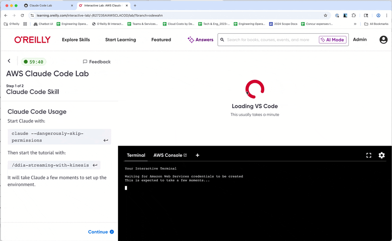

Click the button below to launch the lab in a new tab.  (Note that you'll need a B2B acount on the O'Reilly Leaning Platform.):

<a href="https://learning.oreilly.com/interactive-lab/-/627235AIAWSCLACOD/lab/?branch=odewahn" target="_blank" rel="noopener" class="md-button md-button--primary">
  Launch Claude Code Lab
</a>

Note that it may take a bit for the Lab to fully spin up because it is also provisioning a temporary AWS environment. Then:

* Wait for the lab to fully start
* Click the `claude --dangerously-skip-permissions` link
* Use the arrow key to click "Yes" to run in dangerous mode

