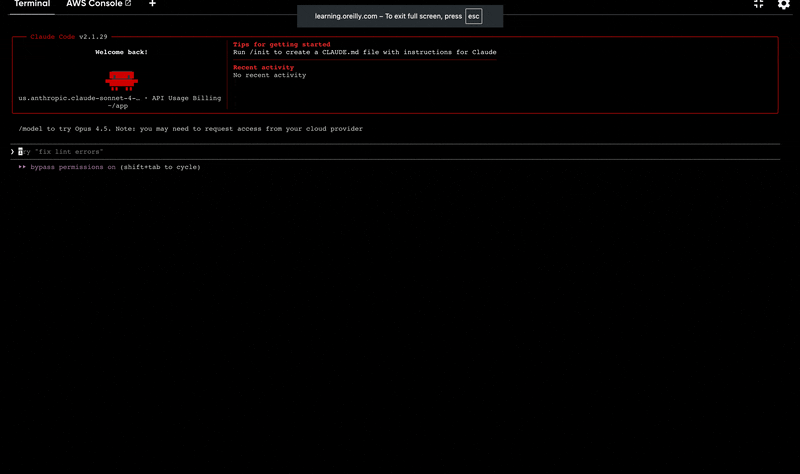

[Skills]() are a way to package complex instructions so that an LLM can use them to perform specific tasks. Skills can be installed from a marketplace or created from scratch.  This [Simon Willison article](https://simonwillison.net/2025/Oct/16/claude-skills/) explains why they're useful.

Anthropic has this concept of a *marketplace*, which is a bundle of related skills.  They seem to mostly be git repos that have a special `marketplace.json` manifest that describes the skills in the bundle.  Although the examples here cover public repos only, it should be possible to install private skills as well assuming the appropriate authentication is provided.

In this example, we'll install the *document skills*, which allows Claude to work with documents of various types, and the *example skills*.

* https://github.com/anthropics/skills

This is a sample skill I've createed using the content from Designing Data Intensive Applications:

* https://github.com/odewahn/skill-marketplace-test

# With the Claude UI

Use the `/plugin` command and hit enter.  This will put you into an interactive mode where you can install skills from the marketplace.  Text UIs (sometimes called TUIs, may take a bit of getting used to if you're not familiar with them:

* Use the left and right arrow keys to navigate functions at the top
* Use the up and down arrow keys to select an option from the list
* Each screen has instrutions about what keys you can use
* You'll need to exit and restart Claude to use the skill after installing it

# With the Claude CLI

To install a skill before Claude starts, first add it to the marketplace:

`claude plugin marketplace add anthropics/skills`

Then install the specific skill bundle you want:

`claude plugin install document-skills@anthropic-agent-skills`
`claude plugin install example-skills@anthropic-agent-skills`

# With NPX

Skills can also be installed with NPX.  Here's an example of installing a skill from a GitHub repo:

`npx skills add https://github.com/odewahn/skill-marketplace-test --skill ddia-streaming-with-kinesis`
