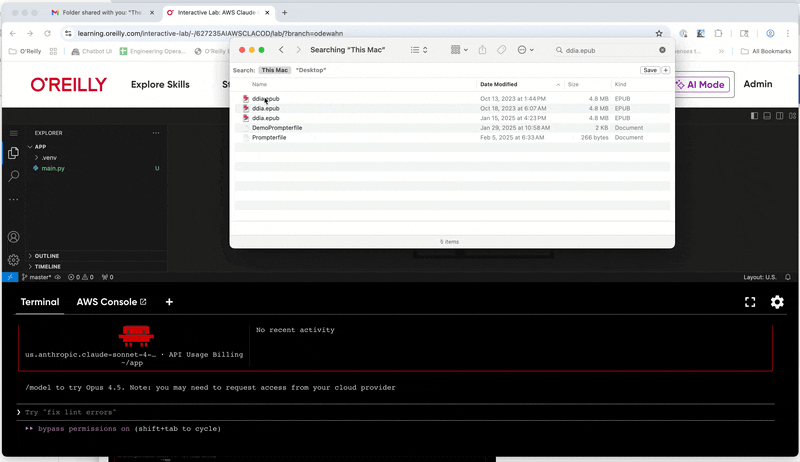

There are several ways to upload content to a lab:

* Clone it from github
* Use `wget` or `curl`
* Drag-and-drop to VSCode

Here's an example of dragging-and-dropping a file from my desktop into the VSCode file explorer:

